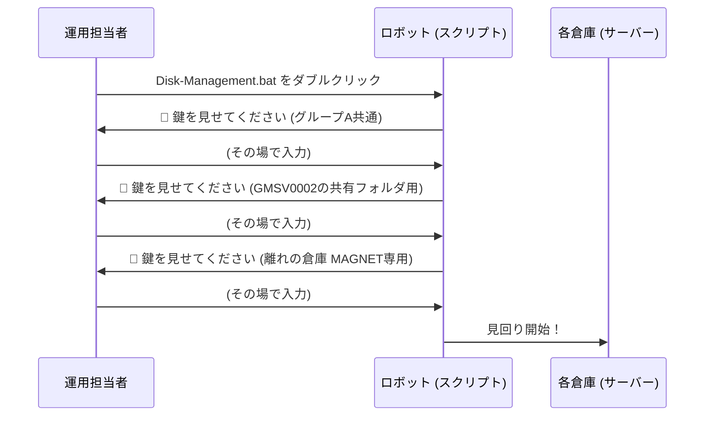
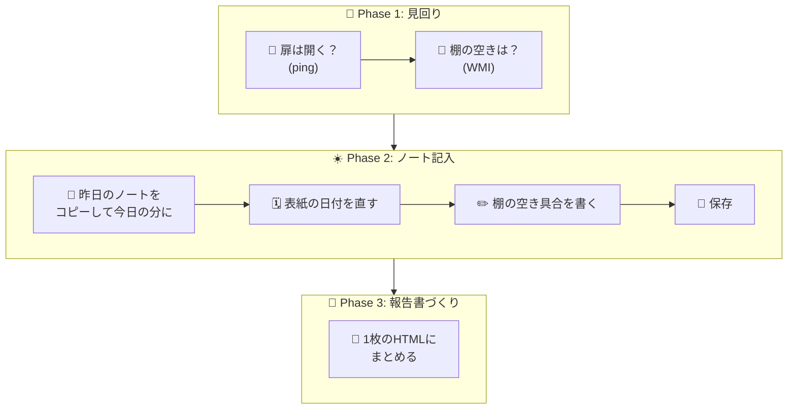

# 🗄️ Server-Disk-Management

**「毎日、9つの倉庫（サーバー）を見回って、ノート（Excel）に記録して、みんなに報告書（HTML）を配る」**
それを全部自動でやってくれるロボットです 🤖

むずかしい言葉は使いません。絵と図でサクッと分かるようにしてあります 👇

---

## 🧸 これは何？

会社には、ファイルや業務システムが入った「倉庫（サーバー）」が **9つ** あります。
倉庫の中には「棚（ディスクドライブ）」があって、荷物（データ）が増えると棚がいっぱいになってしまいます。

このツールは、毎朝ロボットのかわりに

1. 🚪 各倉庫の扉が開くか見に行く（**導通確認**）
2. 📏 棚の空き具合をはかる（**ディスク容量取得**）
3. 📓 会社のノート（**Excel運用日誌**）に書き写す
4. 📰 見回り結果を1枚の新聞（**HTMLレポート**）にする

…を、全部自動でやってくれます。


---

## 🏢 見回る倉庫（対象サーバー）は9つ

| # | 倉庫（サーバー） | 棚（ドライブ） |
|:-:|---|:-:|
| 1 | 🏢 VMSV3001 | `C` |
| 2 | 🏢 GMSV0001 | `C` |
| 3 | 🏬 GMSV0002（一番大きい倉庫） | `C` `D` `E` |
| 4 | 🏢 GMSV0006 | `C` `D` |
| 5 | 🏢 GMSV0008 | `C` `D` |
| 6 | 🏢 GMSV0009 | `C` `D` |
| 7 | 🏢 GMSV0011 | `C` |
| 8 | 🏚️ MAGNET（離れの倉庫） | `C` |
| 9 | 🏢 GMSV0012 | `C` `D` |

---

## 🔑 鍵（ログイン認証）はその場で入力

以前は鍵（パスワード）をロボットのポケット（スクリプト）に入れっぱなしにしていましたが、
今は **実行するたびに、その場で鍵を見せてもらう** 方式に変わりました。合鍵をどこにも保管しないので、より安全です 🔒



- 実行する機器は **AD ドメインに参加している** 必要があります(社内の鍵を確認する仕組みを使うため)。
- 見回る倉庫を絞れば(`-Exclude`)、聞かれる鍵の数もその分だけ少なくなります。
- 🏚️ 離れの倉庫（MAGNET）は、以前に鍵を何度も間違えて自動施錠（アカウントロックアウト）された経験があるので、
  鍵が合わなかったときに何度も試すことは **絶対にしません**。
- 🔑 鍵には2種類あります。**誰が実行しても同じ**鍵と、**実行する人自身の**鍵です。
  | 鍵の場面 | 入力するもの |
  |---|---|
  | グループA共通 / 離れの倉庫(MAGNET) | 運用担当者みんなで共有している管理者アカウント |
  | GMSV0002の共有フォルダ用 | **あなた自身の** MIRAI ドメインアカウント（ユーザー名欄は空なので、自分のユーザー名から入力する） |

---

## 🚶 1日の流れ（3幕構成）



| Phase | やること | 状態 |
|---|---|:-:|
| 1️⃣ 見回り | 9倉庫 × 各ドライブの空き容量を測る | ✅ 稼働中 |
| 2️⃣ ノート記入 | 共有フォルダの Excel 運用日誌を更新・保存する | ✅ 稼働中 |
| 3️⃣ 報告書づくり | `Disk-Management-YYYYMMDDHHMM.HTML` を出力 | ✅ 稼働中 |

---

## 🖱️ 使い方

1. このフォルダ (`Server-Disk-Management`) を、実行したいAD参加済みの端末に置く
2. `Disk-Management.bat` を **ダブルクリック**
   - 管理者権限じゃなければ、UACダイアログが出るので「はい」
3. 🔑 鍵の入力ダイアログが2〜3回出るので、その都度入力する
4. あとは見回りが終わるまで待つだけ ⏳
5. 完了すると、フォルダ直下に `Disk-Management-YYYYMMDDHHMM.HTML` ができるので、ダブルクリックして確認 📰

PowerShell から直接動かしたい場合:

```powershell
# ふつうに実行
powershell.exe -NoProfile -ExecutionPolicy Bypass -File .\Disk-Management.ps1

# 離れの倉庫(MAGNET)だけ今回はお休みさせる
powershell.exe -NoProfile -ExecutionPolicy Bypass -File .\Disk-Management.ps1 -Exclude 'MAGNET.mirai.local'

# ノート記入(Phase 2)はお休みして、見回りと報告書だけにする
powershell.exe -NoProfile -ExecutionPolicy Bypass -File .\Disk-Management.ps1 -SkipExcelUpdate
```

---

## 📰 できあがるレポートの中身

| 見出し | 中身 |
|---|---|
| 🚪 導通(ping) | 扉は開いた？ OK / NG |
| 📏 ディスク容量 | 空き容量 / 全容量 (GB、小数点2桁) |
| 📊 使用率バー | 棚がどれだけ埋まっているか一目でわかるバー |
| 🚦 状態 | 🟢正常 / 🟡警告(80%↑) / 🔴危険(90%↑) |
| 📓 運用日誌転記結果 | フォルダ特定〜保存までの6手順を ✅PASS/❌FAIL/⛔BLOCKED で表示 |

---

## 🧩 ファイル構成

```
Server-Disk-Management/
├── 🖱️ Disk-Management.bat   ← まずこれをダブルクリック
├── 🤖 Disk-Management.ps1   ← ロボットの本体（設定もここに書く）
├── 📄 README.md             ← このファイル
└── 📁 spec/                 ← 詳しい仕様書 (かんたん版もあり)
```

---

## ⚠️ 気をつけてほしいこと

- 🏚️ **離れの倉庫(MAGNET)は要注意。** 鍵の入力を間違えても、その場で1回試すだけにしてください。何度も試すとロックアウトします。
- 📖 「全容量」の欄は実測値で上書きされます。ボリューム拡張などで数値が大きく変わった場合は備考欄に記録されるので、見回りのあとに確認してください。
- 🖥️ ノート記入(Phase 2)には、実行する端末に **Microsoft Excel** が入っている必要があります。

---

## 🛠️ 設定を変えたいとき

`Disk-Management.ps1` の先頭にある「設定」ブロックを見てください。

- `$CredentialGroups` : 鍵（認証グループ）の初期ユーザー名・案内文
- `$Targets` : 倉庫（機器）一覧、棚（ドライブ）、どの鍵グループを使うか
- `$Config.WarnPercent` / `$Config.CritPercent` : 🟡警告・🔴危険のライン
- `$SheetRowMap` : Excel「サーバー管理日誌(統合)」シートの行対応表

もっと詳しく知りたい人は `spec/` フォルダの仕様書もどうぞ 📚
